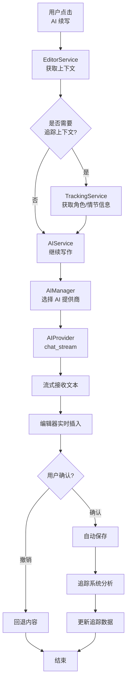
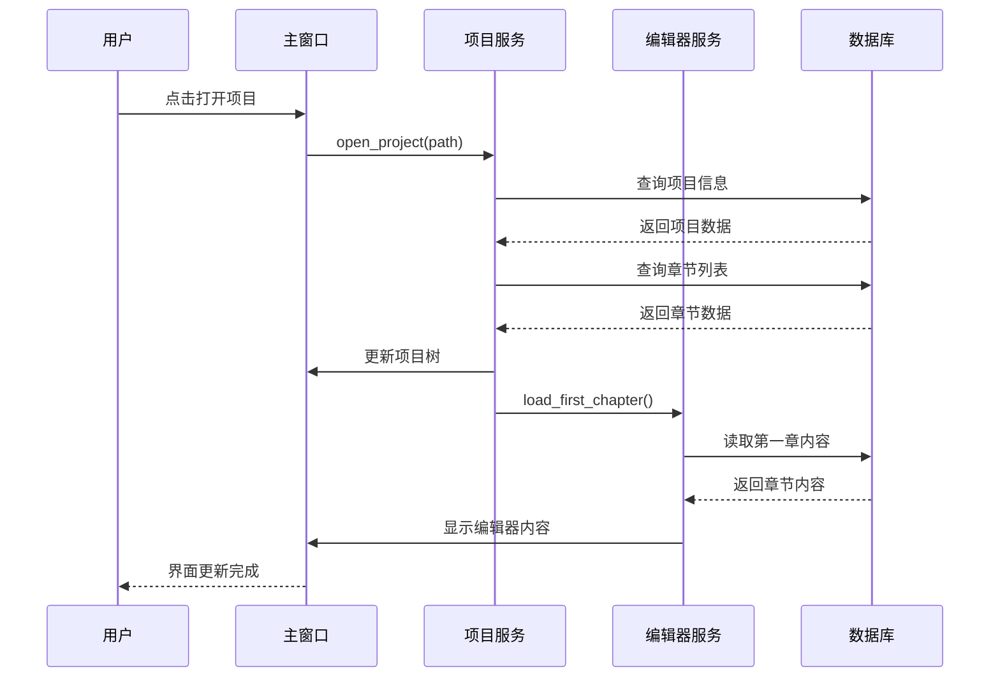

# 系统架构设计

## 1. 架构概述

Novel Writer PySide6 版采用**分层架构**设计，将桌面应用的复杂性分解为清晰的层次结构。核心设计理念：

1. **关注点分离**：UI 层、业务逻辑层、数据层严格分离
2. **依赖倒置**：上层依赖下层抽象，而非具体实现
3. **可测试性**：业务逻辑与 UI 解耦，便于单元测试
4. **可扩展性**：插件化架构，功能可灵活扩展
5. **本地优先**：数据本地存储，离线可用，隐私安全

---

## 2. 分层架构设计

### 2.1 架构分层总览

```
┌─────────────────────────────────────────────────────┐
│                     UI 层                            │
│  (主窗口、编辑器、侧边栏、对话框、QSS 样式)          │
├─────────────────────────────────────────────────────┤
│                   服务层 (Service)                    │
│  (项目服务、编辑器服务、AI 服务、追踪服务)           │
├─────────────────────────────────────────────────────┤
│                   核心层 (Core)                       │
│  (写作引擎、方法论、AI 接口、追踪系统、插件系统)     │
├─────────────────────────────────────────────────────┤
│                   模型层 (Model)                      │
│  (数据模型、数据库连接、ORM 映射、数据访问)          │
├─────────────────────────────────────────────────────┤
│                   工具层 (Utils)                      │
│  (日志、文件、文本、加密、日期工具)                  │
└─────────────────────────────────────────────────────┘
```

### 2.2 各层职责说明

| 层级 | 目录 | 核心职责 | 依赖 |
|------|------|----------|------|
| **UI 层** | `ui/` | 用户界面展示、用户交互事件处理、界面状态管理 | Service 层 |
| **服务层** | `services/` | 连接 UI 和 Core，协调业务逻辑，事务管理 | Core 层、Model 层 |
| **核心层** | `core/` | 核心业务逻辑、写作引擎、AI 接口、插件系统 | Model 层、Utils |
| **模型层** | `models/` | 数据模型定义、数据库连接、数据访问对象 | 无（底层） |
| **工具层** | `utils/` | 通用工具函数、辅助类 | 无（底层） |

### 2.3 依赖规则

- **单向依赖**：上层依赖下层，下层不依赖上层
- **UI 层** → **服务层** → **核心层** → **模型层**
- **工具层** 可被所有层使用
- 跨层调用必须通过接口/抽象，不能直接依赖具体实现

---

## 3. 核心模块设计

### 3.1 模块总览

| 模块 | 路径 | 核心职责 | 运行时状态 |
|------|------|----------|-----------|
| 应用入口 | `app/main.py` | 应用初始化、主窗口创建、事件循环启动 | 是 |
| 配置管理 | `app/config.py` | 全局配置加载、保存、环境变量管理 | 是 |
| 主窗口 | `ui/main_window.py` | 主界面框架、菜单、工具栏、状态栏 | 是 |
| 编辑器组件 | `ui/editor/` | 富文本/Markdown 编辑、搜索替换、容器管理 | 是 |
| 侧边栏组件 | `ui/sidebar/` | 项目树、AI 面板、角色面板、大纲面板 | 是 |
| 对话框 | `ui/dialogs/` | 新建项目、设置、AI 配置等对话框 | 是 |
| 样式管理 | `ui/styles/` | QSS 主题、样式切换、主题定制 | 是 |
| 项目服务 | `services/project_service.py` | 项目 CRUD、项目切换、项目导入导出 | 是 |
| 编辑器服务 | `services/editor_service.py` | 编辑器状态同步、自动保存、撤销重做 | 是 |
| AI 服务 | `services/ai_service.py` | AI 对话管理、流式输出、多模型调度 | 是 |
| 项目管理 | `core/project/` | 项目模型、项目配置、项目文件管理 | 是 |
| 写作引擎 | `core/writing/` | 章节管理、大纲引擎、字数统计 | 是 |
| 写作方法论 | `core/methods/` | 6 种写作方法、方法推荐、方法转换 | 是 |
| AI 接口层 | `core/ai/` | AI 提供商适配、提示词模板、AI 服务 | 是 |
| 追踪系统 | `core/tracking/` | 情节、角色、关系、时间线追踪 | 是 |
| 插件系统 | `core/plugins/` | 插件加载、插件管理、插件生命周期 | 是 |
| 数据库 | `models/database.py` | SQLite 连接、会话管理、初始化 | 是 |
| 数据模型 | `models/*.py` | SQLAlchemy ORM 模型定义 | 是 |
| 工具函数 | `utils/*.py` | 日志、文件、文本、加密、日期工具 | 是 |

### 3.2 各模块详细说明

#### 应用入口 (`app/main.py`)

**输入**：命令行参数（如 `--project <path>`）

**输出**：启动主窗口，进入事件循环

**核心函数/类**：

| 函数/类 | 职责 |
|---------|------|
| `main()` | 应用入口函数 |
| `initialize_app()` | 初始化配置、日志、数据库、插件系统 |
| `create_main_window()` | 创建并显示主窗口 |

> 注：文档原始设计包含 `NovelWriterApplication` 应用主类，实际实现直接使用 `QApplication`，应用级别功能由 `AppConfig`、`db_manager`、`signal_bus` 等单例分担。

---

#### 配置管理 (`app/config.py`)

**输入**：配置文件路径、环境变量

**输出**：全局配置对象

**核心类**：

```python
class AppConfig:
    app_name: str = "Novel Writer"
    app_version: str = "1.0.0"
    data_dir: str = "~/NovelWriter"
    theme: str = "dark"
    language: str = "zh-CN"
    auto_save_interval: int = 30  # 秒
    ai_default_provider: str = "openai"
    ai_temperature: float = 0.7
    ai_max_tokens: int = 4000

    @classmethod
    def load(cls) -> "AppConfig": ...
    def save(self) -> None: ...
    def update(self, **kwargs) -> None: ...
```

**实际存储方式**（三层分治，无重叠）：
- **`config.json` / `AppConfig`**：仅存储引导配置（`data_dir`、`app_name`、`app_version`），DB 初始化前必须读取
- **`app_config` SQLite 表 / `app_config_service`**：存储运行时业务配置（主题、语言、自动保存间隔、撤销栈深度等），应用启动后通过 `app_config_service.get/set` 读写
- **QSettings**：仅存储 UI 状态（窗口几何、最近项目列表），Qt 原生管理

**`config.json` 文件位置**：
- Windows: `%APPDATA%/NovelWriter/config.json`
- macOS: `~/Library/Application Support/NovelWriter/config.json`
- Linux: `~/.config/NovelWriter/config.json`

---

#### 主窗口 (`ui/main_window.py`)

**输入**：用户操作、系统事件

**输出**：界面渲染、状态更新

**核心类**：

```python
class MainWindow(QMainWindow):
    def __init__(self):
        super().__init__()
        self.project_service = ProjectService()
        self.editor_service = EditorService()
        self.ai_service = AIService()

        self.init_ui()
        self.init_menu()
        self.init_toolbar()
        self.init_statusbar()
        self.init_connections()

    def init_ui(self): ...
    def init_menu(self): ...
    def init_toolbar(self): ...
    def init_statusbar(self): ...
    def init_connections(self): ...

    def open_project(self, path: str): ...
    def new_project(self): ...
    def save_all(self): ...
```

**界面布局**：

```
┌───────────────────────────────────────────────────────────┐
│  菜单栏 (File, Edit, View, Project, Writing, AI, Help)     │
├───────────────────────────────────────────────────────────┤
│  工具栏 (新建、打开、保存、撤销、重做、AI 对话、设置)      │
├──────┬──────────────────────────────────────┬─────────────┤
│      │                                      │             │
│ 左   │                                      │   右       │
│ 侧   │           中央编辑器区域              │   侧       │
│ 边   │                                      │   边       │
│ 栏   │   (富文本编辑器 / Markdown 编辑)     │   栏       │
│      │                                      │             │
│ 项  │                                      │  AI 面板   │
│ 目  │                                      │  角色面板  │
│ 树  │                                      │  大纲面板  │
│      │                                      │             │
├──────┴──────────────────────────────────────┴─────────────┤
│  状态栏 (字数、行数、当前项目、保存状态、AI 状态)          │
└───────────────────────────────────────────────────────────┘
```

---

#### 编辑器组件 (`ui/editor/`)

**核心类**：

| 类名 | 文件 | 职责 |
|------|------|------|
| `EditorWidget` | `editor_widget.py` | 富文本/Markdown 模式切换编辑器，基于 QTextEdit |
| `EditorContainer` | `editor_container.py` | 编辑器容器，集成搜索面板、搜索结果列表 |
| `SearchPanel` | `search_panel.py` | 搜索/替换面板，支持正则、大小写、全词匹配 |

> 注：大纲视图实现在 `ui/sidebar/outline_panel.py` 中作为侧边栏面板；标签页由 `MainWindow` 中的 `QTabWidget` 直接管理。

**EditorWidget 核心功能**：

```python
class EditorWidget(QTextEdit):
    """富文本/Markdown 模式切换编辑器。
    注：文档原始设计包含独立的 TextEditor、MarkdownEditor、OutlineView、EditorTabWidget，
    实际实现统一为 EditorWidget（模式切换）+ EditorContainer（组合容器），
    大纲视图移至 ui/sidebar/outline_panel.py。
    """
    def __init__(self, parent=None):
        super().__init__(parent)
        self.word_count = 0

    def get_word_count(self) -> int: ...
    def get_char_count(self) -> int: ...
    def get_paragraph_count(self) -> int: ...
    def set_content(self, content: str): ...
    def get_content(self) -> str: ...
    def insert_at_cursor(self, text: str): ...
    def toggle_bold(self): ...
    def toggle_italic(self): ...
    def toggle_heading(self, level: int): ...
```

---

#### 写作方法论 (`core/methods/`)

**输入**：故事特征、当前方法、目标方法

**输出**：方法推荐、结构转换、混合方案

**核心类**：

```python
class WritingMethod(ABC):
    name: str
    display_name: str
    description: str
    stages: List[Stage]

    @abstractmethod
    def get_structure(self) -> Structure: ...
    @abstractmethod
    def validate_outline(self, outline: Outline) -> ValidationResult: ...

class ThreeActMethod(WritingMethod): ...       # 三幕式
class HeroJourneyMethod(WritingMethod): ...    # 英雄之旅
class StoryCircleMethod(WritingMethod): ...    # 故事圈
class SevenPointMethod(WritingMethod): ...     # 七点结构
class PixarFormulaMethod(WritingMethod): ...   # 皮克斯公式
class SnowflakeMethod(WritingMethod): ...      # 雪花法

class MethodAdvisor:
    def recommend(self, features: StoryFeatures) -> List[MethodScore]: ...
    def calculate_score(self, features: StoryFeatures, method: WritingMethod) -> MethodScore: ...
    def analyze_match(self, features: StoryFeatures, method: WritingMethod) -> MatchAnalysis: ...

class MethodConverter:
    def convert(self, content: StoryContent, target_method: str) -> ConversionResult: ...
    def generate_conversion_report(self, content: StoryContent, target_method: str) -> str: ...

class HybridMethodManager:
    def recommend_hybrid(self, genre: str, length: int, complexity: str) -> HybridConfig: ...
    def create_hybrid_structure(self, config: HybridConfig, story_details: dict) -> HybridStructure: ...
```

**评分权重**（与原版保持一致）：
- 类型匹配：30 分
- 长度匹配：20 分
- 受众匹配：15 分
- 经验匹配：15 分
- 创作重点匹配：10 分
- 节奏匹配：5 分
- 复杂度匹配：5 分
- **总分**：100 分

---

#### AI 接口层 (`core/ai/`)

**输入**：提示词、模型配置、上下文

**输出**：AI 生成内容

**核心架构**：

```python
# AI 提供商基类
class AIProvider(ABC):
    name: str
    display_name: str

    def chat(self, messages: List[Message], **kwargs) -> str: ...
    def chat_stream(self, messages: List[Message], **kwargs) -> Generator[str]: ...
    def get_models(self) -> List[str]: ...

# 具体提供商
class OpenAIProvider(AIProvider): ...
class AnthropicProvider(AIProvider): ...
class GoogleProvider(AIProvider): ...
class OllamaProvider(AIProvider): ...
class DeepSeekProvider(AIProvider): ...

# AI 后台线程 Worker
class AIWorker(QThread):
    """AI 调用后台线程，支持流式输出和取消。
    
    注：文档原始设计使用 async/await，但 PySide6 事件循环与 asyncio 不兼容，
    实际实现使用 QThread + 信号槽机制。流式文本通过 chunk_received 信号发射。
    """
    chunk_received = Signal(str)
    finished_signal = Signal(str)
    error_signal = Signal(str)

# AI 管理器
class AIManager:
    def __init__(self):
        self.providers: Dict[str, AIProvider] = {}
        self.current_provider: str = "openai"

    def register_provider(self, provider: AIProvider): ...
    def get_provider(self, name: str) -> AIProvider: ...
    def generate(self, prompt: str, **kwargs) -> str: ...
    def generate_stream(self, prompt: str, **kwargs) -> Generator[str]: ...

# 提示词模板
class PromptTemplate:
    def __init__(self, template: str):
        self.template = template

    def render(self, **kwargs) -> str: ...

# AI 服务（通过 services/ai_service.py 统一调用）
class AIService:
    """AI 服务 Facade - 统一封装 core/ai/ 子模块的调用。
    UI 层通过此服务调用 AI，不直接引用 core/ai/ 子模块。
    """
    def continue_writing(self, chapter_id: int, project_id: int, max_tokens: int = 2000) -> AIWorker: ...
    def polish_text(self, text: str, style: str = "简洁") -> AIWorker: ...
    def rewrite_text(self, text: str, style: str = "扩写") -> AIWorker: ...
    def analyze_chapter(self, content: str, context: str = "") -> AIWorker: ...
```

---

#### 追踪系统 (`core/tracking/`)

**输入**：章节内容、用户手动输入

**输出**：更新的追踪数据、一致性检查报告

**核心类**：

```python
class PlotTracker:
    def add_plot_node(self, node: PlotNode): ...
    def update_node_status(self, node_id: str, status: str): ...
    def add_foreshadowing(self, foreshadowing: Foreshadowing): ...
    def add_conflict(self, conflict: Conflict): ...
    def get_current_stage(self) -> str: ...

class CharacterTracker:
    def add_character(self, character: Character): ...
    def update_character_status(self, char_id: str, status: dict): ...
    def record_appearance(self, char_id: str, chapter: int, role: str): ...
    def get_character_arc(self, char_id: str) -> CharacterArc: ...

class RelationshipTracker:
    def add_relationship(self, rel: Relationship): ...
    def update_relationship(self, rel_id: str, status: str): ...
    def add_faction(self, faction: Faction): ...
    def get_relationship_graph(self) -> nx.Graph: ...  # networkx

class TimelineManager:
    def add_event(self, event: TimelineEvent): ...
    def get_events_between(self, start_chapter: int, end_chapter: int) -> List[TimelineEvent]: ...
    def validate_timeline(self) -> List[TimelineIssue]: ...

class ConsistencyChecker:
    def check_all(self, project_id: int) -> ConsistencyReport: ...
    def check_character_consistency(self, text: str) -> List[Issue]: ...
    def check_relationship_consistency(self, text: str) -> List[Issue]: ...
    def check_world_rules(self, text: str) -> List[Issue]: ...
```

---

#### 插件系统 (`core/plugins/`)

**输入**：插件目录、插件配置

**输出**：加载的插件、扩展功能

**核心类**：

```python
class PluginBase(ABC):
    name: str
    version: str
    description: str
    author: str

    def on_load(self): ...      # 插件加载时调用
    def on_unload(self): ...    # 插件卸载时调用
    def on_enable(self): ...    # 启用时调用
    def on_disable(self): ...   # 禁用时调用

class PluginManager:
    def __init__(self):
        self.plugins: Dict[str, PluginBase] = {}
        self.plugin_dir: str = "plugins"

    def discover_plugins(self): ...
    def load_plugin(self, plugin_name: str) -> bool: ...
    def unload_plugin(self, plugin_name: str) -> bool: ...
    def enable_plugin(self, plugin_name: str): ...
    def disable_plugin(self, plugin_name: str): ...
    def list_plugins(self) -> List[PluginInfo]: ...
    def get_plugin(self, plugin_name: str) -> PluginBase: ...
```

**插件扩展点**：

| 扩展点 | 说明 |
|--------|------|
| `ui_menu` | 扩展菜单栏 |
| `ui_sidebar` | 扩展侧边栏标签页 |
| `ai_provider` | 新增 AI 提供商 |
| `writing_method` | 新增写作方法论 |
| `export_format` | 新增导出格式 |
| `tracker` | 新增追踪器 |
| `command` | 新增命令 |

---

#### 数据库层 (`models/database.py`)

采用双层数据库架构：应用级全局 DB 和项目级独立 DB。

**核心类**：

```python
from sqlalchemy import create_engine
from sqlalchemy.orm import sessionmaker, DeclarativeBase
from sqlalchemy import text

class AppBase(DeclarativeBase):
    """应用级数据表的 Base（全局 DB：novel_writer.db）。"""
    pass

class ProjectBase(DeclarativeBase):
    """项目级数据表的 Base（每个项目独立 DB：project.db）。"""
    pass

class DatabaseManager:
    _instance = None

    def __new__(cls):
        if cls._instance is None:
            cls._instance = super().__new__(cls)
        return cls._instance

    def __init__(self):
        self._app_engine = None
        self._app_session_factory = None
        self._project_engine = None
        self._project_session_factory = None

    def init_app_db(self, db_path: str):
        self._app_engine = create_engine(f"sqlite:///{db_path}")
        self._app_session_factory = sessionmaker(
            autocommit=False, autoflush=False, bind=self._app_engine
        )
        AppBase.metadata.create_all(self._app_engine)
        with self._app_engine.connect() as conn:
            conn.execute(text("PRAGMA journal_mode=WAL"))

    def init_project_db(self, db_path: str):
        self._project_engine = create_engine(f"sqlite:///{db_path}")
        self._project_session_factory = sessionmaker(
            autocommit=False, autoflush=False, bind=self._project_engine
        )
        ProjectBase.metadata.create_all(self._project_engine)

    def get_app_session(self) -> Session:
        return self._app_session_factory()

    def get_project_session(self) -> Session:
        return self._project_session_factory()

    def close(self):
        if self._app_engine:
            self._app_engine.dispose()
        if self._project_engine:
            self._project_engine.dispose()
```

---

## 4. 模块调用关系

### 4.1 完整用户操作流程

#### 流程一：启动应用并打开项目

```
用户双击图标 / 命令行启动
    ↓
app/main.py: main()
    ↓
QApplication 初始化
    ├── 加载配置 (app/config.py)
    ├── 初始化日志 (utils/logger.py)
    ├── 初始化数据库 (models/database.py)
    ├── 初始化插件系统 (core/plugins/)
    └── 创建主窗口 (ui/main_window.py)
            ↓
    显示主窗口，进入事件循环
            ↓
用户点击「打开项目」
            ↓
    ProjectService.open_project(path)
            ↓
    ├── 读取项目元数据
    ├── 加载章节列表
    ├── 加载追踪数据
    └── 更新 UI
            ↓
    显示项目树，打开第一个章节
```

#### 流程二：AI 辅助写作（核心工作流）

```
用户在编辑器中选中文字 / 光标定位
    ↓
点击「AI 续写」或快捷键
    ↓
EditorService 获取上下文
    ├── 当前章节内容
    ├── 光标位置
    ├── 前文摘要（如需要）
    └── 角色/情节上下文（从追踪系统）
            ↓
    AIService.continue_writing(context)
            ↓
    AIManager.generate_stream(prompt)
            ↓
    AIProvider.chat_stream(messages)
            ↓
    流式返回文本
            ↓
    编辑器实时插入文本（打字机效果）
            ↓
用户确认 / 修改 / 撤销
    ↓
自动保存
    ↓
追踪系统分析新内容（可选）
    ├── 提取新角色
    ├── 更新情节节点
    ├── 记录出场
    └── 一致性检查
```

#### 流程三：写作方法推荐

```
用户打开「方法推荐」对话框
    ↓
填写小说特征（类型、长度、受众等）
    ↓
点击「推荐」
    ↓
MethodAdvisor.recommend(features)
    ├── calculate_score() - 计算各方法匹配度
    ├── analyze_match() - 分析优缺点
    └── 按分数排序
            ↓
    显示推荐结果列表
            ↓
用户选择方法
    ↓
项目服务更新项目配置
    ↓
大纲视图切换为对应方法的结构
```

---

### 4.2 Mermaid 流程图：AI 辅助写作



### 4.3 Mermaid 序列图：项目打开



---

## 5. 状态管理

### 5.1 状态管理方式

| 状态类型 | 存储位置 | 说明 |
|----------|----------|------|
| **应用配置** | 分层：引导→`config.json`，运行时→`app_config` 表，UI 状态→QSettings | 三层分治无重叠：AppConfig 仅 data_dir 等引导配置，app_config_service 管理主题/语言等业务配置，QSettings 管理窗口大小/最近项目等 UI 状态 |
| **项目元数据** | SQLite `projects` 表 | 项目基本信息、创建时间、最后打开时间 |
| **章节内容** | SQLite `chapters` 表 / 文件系统 | 章节正文内容 |
| **追踪数据** | SQLite 多张表 | 情节、角色、关系、时间线 |
| **UI 状态** | QSettings / 内存 | 窗口大小、分隔条位置、最近打开列表 |
| **编辑器状态** | 内存 | 光标位置、选中内容、撤销栈 |
| **AI 对话历史** | SQLite `ai_conversations` 表 | AI 对话记录 |

### 5.2 状态更新机制

```
用户操作 → UI 事件 → Service 层 → Core 层 → Model 层 → 持久化
                                                       ↓
                                             UI 状态更新（信号槽）
```

**Qt 信号槽机制**：
- 业务逻辑通过信号通知 UI 更新
- UI 通过槽函数响应状态变化
- 实现数据绑定，解耦业务与界面

---

## 6. 架构特点总结

### 6.1 核心设计理念

1. **分层架构**：清晰的层次划分，职责明确
2. **本地优先**：数据本地存储，离线可用，隐私安全
3. **插件化扩展**：灵活的插件系统，功能可定制
4. **AI 原生**：深度集成 AI 能力，智能辅助创作
5. **方法论驱动**：内置多种经典写作方法论
6. **完整追踪**：情节、角色、关系、时间线全方位追踪

### 6.2 关键设计模式

| 模式 | 应用场景 |
|------|----------|
| **MVC / MVP** | UI 层与业务逻辑分离 |
| **单例模式** | 数据库管理器、配置管理器 |
| **工厂模式** | AI 提供商创建、写作方法创建 |
| **策略模式** | 方法推荐评分算法、AI 提供商切换 |
| **观察者模式** | Qt 信号槽、状态变化通知 |
| **模板方法** | 写作方法论基类 |
| **插件模式** | 功能扩展系统 |
| **仓储模式** | 数据访问层 |

### 6.3 数据流总结

```
用户输入 → UI 层 → 服务层 → 核心层 → 模型层 → 持久化
   ↑                                            ↓
   └──────────── 信号/回调 ←────────────────────┘
```

**输入**：用户交互、键盘鼠标、AI 响应
**输出**：界面渲染、数据持久化、文件导出

### 6.4 与原版架构对比

| 维度 | 原版（CLI + 文件） | PySide6 版（桌面应用） |
|------|-------------------|-----------------------|
| **架构模式** | CLI + 文件系统 | 分层架构（UI/Service/Core/Model） |
| **数据存储** | JSON/YAML/Markdown 文件 | SQLite 数据库 + 文件系统 |
| **AI 集成** | 命令模板（依赖 AI 助手） | 直接 API 调用 + 本地模型 |
| **UI 技术** | 无 GUI | PySide6 (Qt Widgets) |
| **状态管理** | 文件即状态 | 内存状态 + 数据库持久化 |
| **插件系统** | 命令注入 | 完整插件框架（UI 扩展 + 逻辑扩展） |
| **用户体验** | 技术门槛高 | 开箱即用，图形化操作 |

---

## 7. 技术债务与演进方向

### 7.1 当前已知技术债务

| 债务项 | 影响 | 优先级 |
|--------|------|--------|
| 富文本编辑器复杂度高 | 功能迭代慢 | 高 |
| 多项目并发访问限制 | 同时打开多个项目困难 | 中 |
| 大文件性能 | 超长小说编辑卡顿 | 中 |
| 插件 API 稳定性 | 插件兼容性问题 | 低 |

### 7.2 架构演进方向

1. **短期（1-3月）**：完善基础功能，优化性能
2. **中期（3-6月）**：插件生态、云同步、协作功能
3. **长期（6月+）**：Web 端、移动端、AI 模型本地微调
