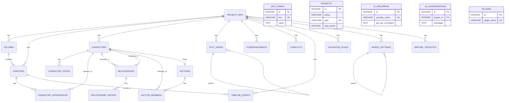

# 数据库设计

## 1. 数据库设计概述

Novel Writer PySide6 版采用 **SQLite** 作为本地数据库，配合 **SQLAlchemy 2.0** 作为 ORM 框架。核心设计理念：

1. **本地优先**：所有数据本地存储，离线可用
2. **零配置**：SQLite 零配置，开箱即用
3. **高性能**：单文件数据库，查询高效
4. **可移植**：数据库文件可直接复制迁移
5. **向后兼容**：支持从原版 JSON 文件导入

### 1.1 技术选型

| 项目 | 选型 | 说明 |
|------|------|------|
| **数据库** | SQLite 3 | 内嵌式关系型数据库，Python 内置支持 |
| **ORM** | SQLAlchemy 2.0 | 成熟的 Python ORM 框架 |
| **迁移工具** | Alembic | SQLAlchemy 官方迁移工具（可选） |
| **连接池** | 内置 | SQLite 单连接，线程安全处理 |

### 1.2 数据库文件位置

| 操作系统 | 路径 |
|---------|------|
| **Windows** | `%APPDATA%/NovelWriter/novel_writer.db` |
| **macOS** | `~/Library/Application Support/NovelWriter/novel_writer.db` |
| **Linux** | `~/.local/share/NovelWriter/novel_writer.db` |

**项目级数据**：每个项目也有独立的数据库文件，存储在项目目录下的 `.novel/project.db`。

---

## 2. 数据表设计总览

### 2.1 应用级数据表（全局）

| 表名 | 用途说明 | 数据来源 |
|------|----------|----------|
| `app_config` | 应用全局配置 | 用户设置 |
| `projects` | 项目列表（元数据） | 用户创建 |
| `ai_providers` | AI 提供商配置 | 用户配置 |
| `ai_conversations` | AI 对话历史 | AI 交互 |
| `plugins` | 插件列表与配置 | 插件安装 |

### 2.2 项目级数据表（每个项目独立）

| 表名 | 用途说明 | 对应原版文件 |
|------|----------|-------------|
| `project_info` | 项目基本信息 | `.specify/config.json` |
| `chapters` | 章节列表与内容 | `stories/` |
| `volumes` | 分卷信息 | 章节目录结构 |
| `characters` | 角色档案 | `spec/knowledge/character-profiles.md` |
| `character_states` | 角色状态追踪 | `spec/tracking/character-state.json` |
| `character_appearances` | 角色出场记录 | `character-state.json` 中 appearanceTracking |
| `plot_nodes` | 情节节点 | `plot-tracker.json` 中 plotlines |
| `foreshadowings` | 伏笔 | `plot-tracker.json` 中 foreshadowing |
| `conflicts` | 冲突 | `plot-tracker.json` 中 conflicts |
| `relationships` | 角色关系 | `relationships.json` 中 characters |
| `factions` | 派系 | `relationships.json` 中 factions |
| `relationship_history` | 关系变化历史 | `relationships.json` 中 history |
| `timeline_events` | 时间线事件 | `timeline.json` 中 events |
| `validation_rules` | 验证规则 | `validation-rules.json` |
| `world_settings` | 世界观设定 | `spec/knowledge/world-setting.md` |
| `writing_method_config` | 写作方法配置 | 项目 method 字段 |
| `writing_statistics` | 写作统计 | 自动生成 |

---

## 3. 应用级数据表详细设计

### 3.1 app_config（应用配置表）

存储全局应用配置。

| 字段名 | 类型 | 约束 | 说明 | 默认值 |
|--------|------|------|------|--------|
| `id` | INTEGER | PRIMARY KEY AUTOINCREMENT | 主键 | - |
| `key` | VARCHAR(100) | UNIQUE NOT NULL | 配置键 | - |
| `value` | TEXT | - | 配置值（JSON 格式存储复杂类型） | NULL |
| `created_at` | DATETIME | NOT NULL | 创建时间 | CURRENT_TIMESTAMP |
| `updated_at` | DATETIME | NOT NULL | 更新时间 | CURRENT_TIMESTAMP |

**常用配置键示例**：
- `theme` - 主题（dark/light）
- `language` - 语言（zh-CN/en-US）
- `auto_save_interval` - 自动保存间隔（秒）
- `default_ai_provider` - 默认 AI 提供商
- `last_project_path` - 最后打开的项目路径

---

### 3.2 projects（项目列表表）

存储所有项目的元数据，用于快速列表展示。

| 字段名 | 类型 | 约束 | 说明 | 默认值 |
|--------|------|------|------|--------|
| `id` | INTEGER | PRIMARY KEY AUTOINCREMENT | 主键 | - |
| `name` | VARCHAR(200) | NOT NULL | 项目名称 | - |
| `path` | VARCHAR(500) | UNIQUE NOT NULL | 项目目录路径 | - |
| `description` | TEXT | - | 项目简介 | NULL |
| `genre` | VARCHAR(50) | - | 小说类型 | NULL |
| `writing_method` | VARCHAR(50) | - | 当前写作方法 | 'three-act' |
| `total_words` | INTEGER | - | 总字数 | 0 |
| `chapter_count` | INTEGER | - | 章节数 | 0 |
| `status` | VARCHAR(20) | - | 项目状态（active/completed/paused） | 'active' |
| `cover_image` | VARCHAR(500) | - | 封面图片路径 | NULL |
| `created_at` | DATETIME | NOT NULL | 创建时间 | CURRENT_TIMESTAMP |
| `updated_at` | DATETIME | NOT NULL | 更新时间 | CURRENT_TIMESTAMP |
| `last_opened_at` | DATETIME | - | 最后打开时间 | NULL |

**索引**：
- `idx_projects_updated_at` - 按更新时间排序
- `idx_projects_status` - 按状态筛选

---

### 3.3 ai_providers（AI 提供商配置表）

存储 AI 提供商的配置信息，API Key 加密存储。

| 字段名 | 类型 | 约束 | 说明 | 默认值 |
|--------|------|------|------|--------|
| `id` | INTEGER | PRIMARY KEY AUTOINCREMENT | 主键 | - |
| `provider_name` | VARCHAR(50) | UNIQUE NOT NULL | 提供商名称 | - |
| `display_name` | VARCHAR(100) | NOT NULL | 显示名称 | - |
| `api_key` | TEXT | - | API Key（加密存储） | NULL |
| `api_base` | VARCHAR(500) | - | API 基础地址 | NULL |
| `default_model` | VARCHAR(100) | - | 默认模型 | NULL |
| `is_enabled` | BOOLEAN | - | 是否启用 | true |
| `is_default` | BOOLEAN | - | 是否为默认 | false |
| `config` | TEXT | - | 额外配置（JSON） | NULL |
| `created_at` | DATETIME | NOT NULL | 创建时间 | CURRENT_TIMESTAMP |
| `updated_at` | DATETIME | NOT NULL | 更新时间 | CURRENT_TIMESTAMP |

**支持的提供商**：
- `openai` - OpenAI (GPT-4, GPT-3.5)
- `anthropic` - Anthropic Claude
- `google` - Google Gemini
- `deepseek` - 深度求索
- `ollama` - Ollama 本地模型
- `qwen` - 通义千问
- `doubao` - 豆包

---

### 3.4 ai_conversations（AI 对话历史表）

存储 AI 对话记录，便于回顾和继续对话。

| 字段名 | 类型 | 约束 | 说明 | 默认值 |
|--------|------|------|------|--------|
| `id` | INTEGER | PRIMARY KEY AUTOINCREMENT | 主键 | - |
| `project_id` | INTEGER | - | 关联项目 ID | NULL |
| `title` | VARCHAR(200) | - | 对话标题 | NULL |
| `conversation_type` | VARCHAR(50) | - | 对话类型（continue_writing/polish/outline/chat） | 'chat' |
| `provider_name` | VARCHAR(50) | - | 使用的 AI 提供商 | NULL |
| `model` | VARCHAR(100) | - | 使用的模型 | NULL |
| `messages` | TEXT | NOT NULL | 消息列表（JSON 数组） | - |
| `total_tokens` | INTEGER | - | 总 token 数 | 0 |
| `created_at` | DATETIME | NOT NULL | 创建时间 | CURRENT_TIMESTAMP |
| `updated_at` | DATETIME | NOT NULL | 更新时间 | CURRENT_TIMESTAMP |

**索引**：
- `idx_ai_conversations_project_id` - 按项目查询
- `idx_ai_conversations_updated_at` - 按时间排序

---

### 3.5 plugins（插件表）

存储已安装插件的信息和配置。

| 字段名 | 类型 | 约束 | 说明 | 默认值 |
|--------|------|------|------|--------|
| `id` | INTEGER | PRIMARY KEY AUTOINCREMENT | 主键 | - |
| `plugin_name` | VARCHAR(100) | UNIQUE NOT NULL | 插件名称 | - |
| `display_name` | VARCHAR(200) | NOT NULL | 显示名称 | - |
| `version` | VARCHAR(50) | - | 版本号 | NULL |
| `description` | TEXT | - | 插件描述 | NULL |
| `author` | VARCHAR(100) | - | 作者 | NULL |
| `path` | VARCHAR(500) | NOT NULL | 插件目录路径 | - |
| `is_enabled` | BOOLEAN | - | 是否启用 | true |
| `config` | TEXT | - | 插件配置（JSON） | NULL |
| `installed_at` | DATETIME | - | 安装时间 | NULL |
| `updated_at` | DATETIME | NOT NULL | 更新时间 | CURRENT_TIMESTAMP |

---

## 4. 项目级数据表详细设计

### 4.1 project_info（项目信息表）

每个项目的基本配置信息。

| 字段名 | 类型 | 约束 | 说明 | 默认值 |
|--------|------|------|------|--------|
| `id` | INTEGER | PRIMARY KEY AUTOINCREMENT | 主键 | - |
| `name` | VARCHAR(200) | NOT NULL | 项目名称 | - |
| `type` | VARCHAR(20) | - | 项目类型 | 'novel' |
| `description` | TEXT | - | 项目简介 | NULL |
| `genre` | VARCHAR(50) | - | 小说类型 | NULL |
| `target_audience` | VARCHAR(50) | - | 目标受众 | NULL |
| `tone` | VARCHAR(50) | - | 文风基调 | NULL |
| `themes` | TEXT | - | 主题（JSON 数组） | NULL |
| `estimated_length` | INTEGER | - | 预计字数 | 0 |
| `writing_method` | VARCHAR(50) | - | 当前写作方法 | 'three-act' |
| `hybrid_scheme` | TEXT | - | 混合方法配置（JSON） | NULL |
| `language` | VARCHAR(20) | - | 语言 | 'zh-CN' |
| `status` | VARCHAR(20) | - | 项目状态 | 'active' |
| `config_version` | VARCHAR(20) | - | 配置版本号 | '1.0.0' |
| `created_at` | DATETIME | NOT NULL | 创建时间 | CURRENT_TIMESTAMP |
| `updated_at` | DATETIME | NOT NULL | 更新时间 | CURRENT_TIMESTAMP |

---

### 4.2 volumes（分卷表）

小说分卷信息。

| 字段名 | 类型 | 约束 | 说明 | 默认值 |
|--------|------|------|------|--------|
| `id` | INTEGER | PRIMARY KEY AUTOINCREMENT | 主键 | - |
| `volume_number` | INTEGER | NOT NULL | 卷号 | 1 |
| `title` | VARCHAR(200) | NOT NULL | 卷标题 | - |
| `description` | TEXT | - | 卷简介 | NULL |
| `sort_order` | INTEGER | - | 排序号 | 0 |
| `is_complete` | BOOLEAN | - | 是否完成 | false |
| `created_at` | DATETIME | NOT NULL | 创建时间 | CURRENT_TIMESTAMP |
| `updated_at` | DATETIME | NOT NULL | 更新时间 | CURRENT_TIMESTAMP |

---

### 4.3 chapters（章节表）

章节列表和内容。内容支持富文本（HTML 格式）和纯文本两种存储方式。

| 字段名 | 类型 | 约束 | 说明 | 默认值 |
|--------|------|------|------|--------|
| `id` | INTEGER | PRIMARY KEY AUTOINCREMENT | 主键 | - |
| `volume_id` | INTEGER | - | 所属分卷 ID | NULL |
| `chapter_number` | INTEGER | NOT NULL | 章节号 | 1 |
| `title` | VARCHAR(200) | NOT NULL | 章节标题 | - |
| `subtitle` | VARCHAR(200) | - | 副标题 | NULL |
| `content` | MEDIUMTEXT | - | 章节正文（HTML/Markdown） | NULL |
| `content_plain` | TEXT | - | 纯文本内容（用于搜索、统计） | NULL |
| `word_count` | INTEGER | - | 字数 | 0 |
| `char_count` | INTEGER | - | 字符数 | 0 |
| `paragraph_count` | INTEGER | - | 段落数 | 0 |
| `summary` | TEXT | - | 章节摘要 | NULL |
| `status` | VARCHAR(20) | - | 状态（draft/in-progress/completed） | 'draft' |
| `plot_stage` | VARCHAR(50) | - | 所属情节阶段 | NULL |
| `sort_order` | INTEGER | - | 排序号 | 0 |
| `is_deleted` | BOOLEAN | - | 是否删除（软删除） | false |
| `created_at` | DATETIME | NOT NULL | 创建时间 | CURRENT_TIMESTAMP |
| `updated_at` | DATETIME | NOT NULL | 更新时间 | CURRENT_TIMESTAMP |
| `completed_at` | DATETIME | - | 完成时间 | NULL |

**索引**：
- `idx_chapters_volume_id` - 按分卷查询
- `idx_chapters_sort_order` - 按排序号排序
- `idx_chapters_status` - 按状态筛选
- `idx_chapters_is_deleted` - 过滤已删除

**外键**：
- `volume_id` → `volumes.id` - 级联删除

---

### 4.4 characters（角色表）

角色档案信息。

| 字段名 | 类型 | 约束 | 说明 | 默认值 |
|--------|------|------|------|--------|
| `id` | INTEGER | PRIMARY KEY AUTOINCREMENT | 主键 | - |
| `name` | VARCHAR(100) | NOT NULL | 角色姓名 | - |
| `aliases` | TEXT | - | 别名/昵称（JSON 数组） | NULL |
| `role` | VARCHAR(50) | - | 角色定位（protagonist/deuteragonist/supporting/antagonist/mentor/minor） | 'supporting' |
| `importance` | VARCHAR(20) | - | 重要性（high/medium/low） | 'medium' |
| `gender` | VARCHAR(20) | - | 性别 | NULL |
| `age` | INTEGER | - | 年龄 | NULL |
| `appearance` | TEXT | - | 外貌描述 | NULL |
| `personality` | TEXT | - | 性格描述 | NULL |
| `background` | TEXT | - | 背景故事 | NULL |
| `motivation` | TEXT | - | 动机/目标 | NULL |
| `skills` | TEXT | - | 技能（JSON 数组） | NULL |
| `possessions` | TEXT | - | 持有物品（JSON 数组） | NULL |
| `secrets` | TEXT | - | 秘密（JSON 数组） | NULL |
| `character_arc` | TEXT | - | 成长弧线描述 | NULL |
| `avatar` | VARCHAR(500) | - | 头像图片路径 | NULL |
| `sort_order` | INTEGER | - | 排序号 | 0 |
| `is_deleted` | BOOLEAN | - | 是否删除 | false |
| `created_at` | DATETIME | NOT NULL | 创建时间 | CURRENT_TIMESTAMP |
| `updated_at` | DATETIME | NOT NULL | 更新时间 | CURRENT_TIMESTAMP |

**索引**：
- `idx_characters_role` - 按角色定位筛选
- `idx_characters_importance` - 按重要性筛选

---

### 4.5 character_states（角色状态表）

角色当前状态追踪，记录随剧情发展的状态变化。

| 字段名 | 类型 | 约束 | 说明 | 默认值 |
|--------|------|------|------|--------|
| `id` | INTEGER | PRIMARY KEY AUTOINCREMENT | 主键 | - |
| `character_id` | INTEGER | NOT NULL | 角色 ID | - |
| `chapter_id` | INTEGER | - | 对应章节 ID | NULL |
| `is_alive` | BOOLEAN | - | 是否存活 | true |
| `health_status` | VARCHAR(50) | - | 健康状态 | '良好' |
| `mental_state` | VARCHAR(50) | - | 心理状态 | '正常' |
| `location` | VARCHAR(200) | - | 当前位置 | NULL |
| `position` | VARCHAR(100) | - | 当前身份/职位 | NULL |
| `current_phase` | VARCHAR(50) | - | 成长阶段（起点/发展/转折/高潮/完成） | '起点' |
| `next_goal` | TEXT | - | 下一个目标 | NULL |
| `status_snapshot` | TEXT | - | 完整状态快照（JSON） | NULL |
| `notes` | TEXT | - | 备注 | NULL |
| `created_at` | DATETIME | NOT NULL | 记录时间 | CURRENT_TIMESTAMP |

**索引**：
- `idx_character_states_character_id` - 按角色查询
- `idx_character_states_chapter_id` - 按章节查询

**外键**：
- `character_id` → `characters.id` - 级联删除

---

### 4.6 character_appearances（角色出场记录表）

记录角色在各章节的出场情况。

| 字段名 | 类型 | 约束 | 说明 | 默认值 |
|--------|------|------|------|--------|
| `id` | INTEGER | PRIMARY KEY AUTOINCREMENT | 主键 | - |
| `character_id` | INTEGER | NOT NULL | 角色 ID | - |
| `chapter_id` | INTEGER | NOT NULL | 章节 ID | - |
| `role_type` | VARCHAR(20) | - | 出场类型（major/minor/background） | 'minor' |
| `significance` | TEXT | - | 出场意义 | NULL |
| `scene_description` | TEXT | - | 场景描述 | NULL |
| `created_at` | DATETIME | NOT NULL | 创建时间 | CURRENT_TIMESTAMP |

**索引**：
- `idx_character_appearances_character_id` - 按角色查询
- `idx_character_appearances_chapter_id` - 按章节查询
- `idx_character_appearances_combo` - 组合索引（唯一约束避免重复记录）

**外键**：
- `character_id` → `characters.id` - 级联删除
- `chapter_id` → `chapters.id` - 级联删除

---

### 4.7 plot_nodes（情节节点表）

情节结构节点，对应写作方法论的各个阶段。

| 字段名 | 类型 | 约束 | 说明 | 默认值 |
|--------|------|------|------|--------|
| `id` | INTEGER | PRIMARY KEY AUTOINCREMENT | 主键 | - |
| `parent_id` | INTEGER | - | 父节点 ID（用于层级结构） | NULL |
| `plot_type` | VARCHAR(20) | - | 情节线类型（main/sub/side） | 'main' |
| `name` | VARCHAR(200) | NOT NULL | 节点名称 | - |
| `description` | TEXT | - | 节点描述 | NULL |
| `stage_key` | VARCHAR(100) | - | 方法阶段标识（如 act1, inciting_incident） | NULL |
| `status` | VARCHAR(20) | - | 状态（pending/in-progress/completed/paused） | 'pending' |
| `start_chapter` | INTEGER | - | 开始章节号 | NULL |
| `end_chapter` | INTEGER | - | 结束章节号 | NULL |
| `sort_order` | INTEGER | - | 排序号 | 0 |
| `created_at` | DATETIME | NOT NULL | 创建时间 | CURRENT_TIMESTAMP |
| `updated_at` | DATETIME | NOT NULL | 更新时间 | CURRENT_TIMESTAMP |

**索引**：
- `idx_plot_nodes_parent_id` - 按父节点查询
- `idx_plot_nodes_plot_type` - 按情节线类型筛选
- `idx_plot_nodes_sort_order` - 按排序号排序

**自引用**：
- `parent_id` → `plot_nodes.id` - 树形结构

---

### 4.8 foreshadowings（伏笔表）

伏笔埋设与揭示追踪。

| 字段名 | 类型 | 约束 | 说明 | 默认值 |
|--------|------|------|------|--------|
| `id` | INTEGER | PRIMARY KEY AUTOINCREMENT | 主键 | - |
| `content` | TEXT | NOT NULL | 伏笔内容描述 | - |
| `importance` | VARCHAR(20) | - | 重要性（high/medium/low） | 'medium' |
| `planted_chapter_id` | INTEGER | - | 埋设章节 ID | NULL |
| `planted_description` | TEXT | - | 埋设描述 | NULL |
| `reveal_chapter_id` | INTEGER | - | 揭示章节 ID | NULL |
| `reveal_description` | TEXT | - | 揭示描述 | NULL |
| `status` | VARCHAR(20) | - | 状态（active/revealed/dropped） | 'active' |
| `hints` | TEXT | - | 提示线索（JSON 数组） | NULL |
| `related_characters` | TEXT | - | 关联角色（JSON 数组） | NULL |
| `notes` | TEXT | - | 备注 | NULL |
| `created_at` | DATETIME | NOT NULL | 创建时间 | CURRENT_TIMESTAMP |
| `updated_at` | DATETIME | NOT NULL | 更新时间 | CURRENT_TIMESTAMP |

**索引**：
- `idx_foreshadowings_status` - 按状态筛选
- `idx_foreshadowings_importance` - 按重要性筛选

---

### 4.9 conflicts（冲突表）

冲突列表与状态。

| 字段名 | 类型 | 约束 | 说明 | 默认值 |
|--------|------|------|------|--------|
| `id` | INTEGER | PRIMARY KEY AUTOINCREMENT | 主键 | - |
| `title` | VARCHAR(200) | NOT NULL | 冲突标题 | - |
| `description` | TEXT | - | 冲突描述 | NULL |
| `conflict_type` | VARCHAR(50) | - | 冲突类型（person/person/society/nature/self） | 'person/person' |
| `status` | VARCHAR(20) | - | 状态（active/resolved/upcoming） | 'active' |
| `parties_involved` | TEXT | - | 参与方（JSON 数组） | NULL |
| `start_chapter_id` | INTEGER | - | 开始章节 ID | NULL |
| `end_chapter_id` | INTEGER | - | 结束章节 ID | NULL |
| `resolution` | TEXT | - | 解决方式 | NULL |
| `escalation_level` | INTEGER | - | 升级程度（1-10） | 1 |
| `sort_order` | INTEGER | - | 排序号 | 0 |
| `created_at` | DATETIME | NOT NULL | 创建时间 | CURRENT_TIMESTAMP |
| `updated_at` | DATETIME | NOT NULL | 更新时间 | CURRENT_TIMESTAMP |

---

### 4.10 relationships（关系表）

角色之间的关系。

| 字段名 | 类型 | 约束 | 说明 | 默认值 |
|--------|------|------|------|--------|
| `id` | INTEGER | PRIMARY KEY AUTOINCREMENT | 主键 | - |
| `character_a_id` | INTEGER | NOT NULL | 角色 A ID | - |
| `character_b_id` | INTEGER | NOT NULL | 角色 B ID | - |
| `relationship_type` | VARCHAR(50) | - | 关系类型（ally/enemy/romantic/family/mentor/neutral/unknown） | 'neutral' |
| `description` | TEXT | - | 关系描述 | NULL |
| `initial_relation` | VARCHAR(100) | - | 初始关系 | '陌生人' |
| `current_relation` | VARCHAR(100) | - | 当前关系 | '陌生人' |
| `trajectory` | VARCHAR(20) | - | 发展轨迹（positive/negative/stable） | 'stable' |
| `intensity` | INTEGER | - | 关系强度（1-10） | 5 |
| `key_events` | TEXT | - | 关键事件（JSON 数组） | NULL |
| `notes` | TEXT | - | 备注 | NULL |
| `created_at` | DATETIME | NOT NULL | 创建时间 | CURRENT_TIMESTAMP |
| `updated_at` | DATETIME | NOT NULL | 更新时间 | CURRENT_TIMESTAMP |

**约束**：
- UNIQUE(`character_a_id`, `character_b_id`) - 同一对角色只有一条关系记录

**外键**：
- `character_a_id` → `characters.id` - 级联删除
- `character_b_id` → `characters.id` - 级联删除

---

### 4.11 factions（派系表）

派系/势力信息。

| 字段名 | 类型 | 约束 | 说明 | 默认值 |
|--------|------|------|------|--------|
| `id` | INTEGER | PRIMARY KEY AUTOINCREMENT | 主键 | - |
| `name` | VARCHAR(100) | NOT NULL | 派系名称 | - |
| `description` | TEXT | - | 派系描述 | NULL |
| `leader_id` | INTEGER | - | 领导者角色 ID | NULL |
| `goals` | TEXT | - | 目标（JSON 数组） | NULL |
| `allied_with` | TEXT | - | 盟友派系（JSON 数组） | NULL |
| `opposed_to` | TEXT | - | 敌对派系（JSON 数组） | NULL |
| `status` | VARCHAR(20) | - | 状态（active/dormant/dissolved） | 'active' |
| `sort_order` | INTEGER | - | 排序号 | 0 |
| `created_at` | DATETIME | NOT NULL | 创建时间 | CURRENT_TIMESTAMP |
| `updated_at` | DATETIME | NOT NULL | 更新时间 | CURRENT_TIMESTAMP |

**外键**：
- `leader_id` → `characters.id` - SET NULL

---

### 4.12 faction_members（派系成员表）

派系与角色的关联表（多对多）。

| 字段名 | 类型 | 约束 | 说明 | 默认值 |
|--------|------|------|------|--------|
| `id` | INTEGER | PRIMARY KEY AUTOINCREMENT | 主键 | - |
| `faction_id` | INTEGER | NOT NULL | 派系 ID | - |
| `character_id` | INTEGER | NOT NULL | 角色 ID | - |
| `role_in_faction` | VARCHAR(100) | - | 在派系中的角色/职位 | NULL |
| `join_reason` | TEXT | - | 加入原因 | NULL |
| `joined_chapter_id` | INTEGER | - | 加入章节 | NULL |
| `is_core_member` | BOOLEAN | - | 是否核心成员 | false |
| `sort_order` | INTEGER | - | 排序号 | 0 |
| `created_at` | DATETIME | NOT NULL | 加入时间 | CURRENT_TIMESTAMP |

**约束**：
- UNIQUE(`faction_id`, `character_id`)

---

### 4.13 relationship_history（关系变化历史表）

记录关系随时间的变化。

| 字段名 | 类型 | 约束 | 说明 | 默认值 |
|--------|------|------|------|--------|
| `id` | INTEGER | PRIMARY KEY AUTOINCREMENT | 主键 | - |
| `relationship_id` | INTEGER | NOT NULL | 关系 ID | - |
| `chapter_id` | INTEGER | - | 发生章节 ID | NULL |
| `change_type` | VARCHAR(20) | - | 变化类型（new/change/end） | 'change' |
| `old_relation` | VARCHAR(100) | - | 变化前关系 | NULL |
| `new_relation` | VARCHAR(100) | - | 变化后关系 | NULL |
| `description` | TEXT | - | 变化描述 | NULL |
| `impact` | VARCHAR(20) | - | 影响程度（low/medium/high） | 'medium' |
| `created_at` | DATETIME | NOT NULL | 记录时间 | CURRENT_TIMESTAMP |

**外键**：
- `relationship_id` → `relationships.id` - 级联删除

---

### 4.14 timeline_events（时间线事件表）

故事时间线事件。

| 字段名 | 类型 | 约束 | 说明 | 默认值 |
|--------|------|------|------|--------|
| `id` | INTEGER | PRIMARY KEY AUTOINCREMENT | 主键 | - |
| `event_name` | VARCHAR(200) | NOT NULL | 事件名称 | - |
| `description` | TEXT | - | 事件描述 | NULL |
| `story_date` | VARCHAR(200) | - | 故事内日期/时间点 | NULL |
| `chapter_id` | INTEGER | - | 对应章节 ID | NULL |
| `location` | VARCHAR(200) | - | 发生地点 | NULL |
| `duration` | VARCHAR(100) | - | 持续时间 | NULL |
| `participants` | TEXT | - | 参与者（JSON 数组，角色 ID） | NULL |
| `related_plot_node_id` | INTEGER | - | 关联情节节点 ID | NULL |
| `importance` | VARCHAR(20) | - | 重要性（high/medium/low） | 'medium' |
| `sort_order` | INTEGER | - | 时间排序号 | 0 |
| `created_at` | DATETIME | NOT NULL | 创建时间 | CURRENT_TIMESTAMP |
| `updated_at` | DATETIME | NOT NULL | 更新时间 | CURRENT_TIMESTAMP |

**索引**：
- `idx_timeline_events_chapter_id` - 按章节查询
- `idx_timeline_events_sort_order` - 按时间排序

---

### 4.15 validation_rules（验证规则表）

一致性验证规则配置。

| 字段名 | 类型 | 约束 | 说明 | 默认值 |
|--------|------|------|------|--------|
| `id` | INTEGER | PRIMARY KEY AUTOINCREMENT | 主键 | - |
| `rule_name` | VARCHAR(100) | UNIQUE NOT NULL | 规则名称 | - |
| `category` | VARCHAR(50) | - | 规则类别（character/relationship/world/plot） | 'character' |
| `is_enabled` | BOOLEAN | - | 是否启用 | true |
| `checks` | TEXT | - | 检查项列表（JSON 数组） | NULL |
| `config` | TEXT | - | 规则配置（JSON） | NULL |
| `severity` | VARCHAR(20) | - | 严重程度（error/warning/info） | 'warning' |
| `auto_fix_enabled` | BOOLEAN | - | 是否启用自动修复 | false |
| `confidence_threshold` | FLOAT | - | 自动修复置信度阈值 | 0.9 |
| `created_at` | DATETIME | NOT NULL | 创建时间 | CURRENT_TIMESTAMP |
| `updated_at` | DATETIME | NOT NULL | 更新时间 | CURRENT_TIMESTAMP |

---

### 4.16 world_settings（世界观设定表）

世界观、地点、规则等设定。

| 字段名 | 类型 | 约束 | 说明 | 默认值 |
|--------|------|------|------|--------|
| `id` | INTEGER | PRIMARY KEY AUTOINCREMENT | 主键 | - |
| `setting_type` | VARCHAR(50) | - | 设定类型（location/faction/rule/item/event/lore） | 'location' |
| `name` | VARCHAR(200) | NOT NULL | 设定名称 | - |
| `description` | TEXT | - | 详细描述（支持 Markdown） | NULL |
| `parent_id` | INTEGER | - | 父设定 ID（层级结构） | NULL |
| `importance` | VARCHAR(20) | - | 重要性（high/medium/low） | 'medium' |
| `tags` | TEXT | - | 标签（JSON 数组） | NULL |
| `related_characters` | TEXT | - | 关联角色（JSON 数组） | NULL |
| `sort_order` | INTEGER | - | 排序号 | 0 |
| `created_at` | DATETIME | NOT NULL | 创建时间 | CURRENT_TIMESTAMP |
| `updated_at` | DATETIME | NOT NULL | 更新时间 | CURRENT_TIMESTAMP |

**自引用**：
- `parent_id` → `world_settings.id` - 树形层级结构

---

### 4.17 writing_statistics（写作统计表）

写作统计数据，按天记录。

| 字段名 | 类型 | 约束 | 说明 | 默认值 |
|--------|------|------|------|--------|
| `id` | INTEGER | PRIMARY KEY AUTOINCREMENT | 主键 | - |
| `date` | DATE | UNIQUE NOT NULL | 统计日期 | - |
| `words_written` | INTEGER | - | 今日写字数 | 0 |
| `words_deleted` | INTEGER | - | 删除字数 | 0 |
| `net_words` | INTEGER | - | 净增字数 | 0 |
| `time_spent` | INTEGER | - | 写作时长（秒） | 0 |
| `chapters_started` | INTEGER | - | 开始章节数 | 0 |
| `chapters_finished` | INTEGER | - | 完成章节数 | 0 |
| `sessions` | INTEGER | - | 写作会话次数 | 0 |
| `created_at` | DATETIME | NOT NULL | 创建时间 | CURRENT_TIMESTAMP |
| `updated_at` | DATETIME | NOT NULL | 更新时间 | CURRENT_TIMESTAMP |

**索引**：
- `idx_writing_statistics_date` - 按日期查询

---

## 5. ER 图

### 5.1 Mermaid ER 图



---

## 6. 索引与约束

### 6.1 索引设计原则

1. **主键索引**：所有表都有自增 INTEGER 主键
2. **外键索引**：外键字段都建立索引，加速关联查询
3. **常用查询索引**：对经常用于 WHERE、ORDER BY、JOIN 的字段建索引
4. **组合索引**：对经常组合查询的字段建立组合索引
5. **唯一约束**：对业务唯一的字段建立 UNIQUE 约束

### 6.2 常用查询及索引

| 查询场景 | 涉及表 | 索引字段 |
|---------|--------|----------|
| 按更新时间排序项目 | projects | updated_at DESC |
| 查询项目的章节列表 | chapters | volume_id, sort_order |
| 查询角色的出场记录 | character_appearances | character_id, chapter_id |
| 查询某章节的出场角色 | character_appearances | chapter_id |
| 查询两个角色的关系 | relationships | character_a_id, character_b_id |
| 按时间顺序获取事件 | timeline_events | sort_order |
| 获取某日写作统计 | writing_statistics | date |
| 按状态筛选情节节点 | plot_nodes | plot_type, status, sort_order |

---

## 7. 数据迁移

### 7.1 从原版导入数据

支持从原版 Novel Writer（文件存储）导入数据到 SQLite 数据库。

**导入内容映射**：

| 原版文件 | 目标表 | 说明 |
|---------|--------|------|
| `.specify/config.json` | project_info | 项目基本配置 |
| `stories/*.md` | chapters | 章节内容 |
| `spec/tracking/plot-tracker.json` | plot_nodes, foreshadowings, conflicts | 情节追踪 |
| `spec/tracking/character-state.json` | characters, character_states, character_appearances | 角色状态 |
| `spec/tracking/relationships.json` | relationships, factions, relationship_history | 关系追踪 |
| `spec/tracking/timeline.json` | timeline_events | 时间线 |
| `spec/tracking/validation-rules.json` | validation_rules | 验证规则 |
| `spec/knowledge/character-profiles.md` | characters | 角色档案 |
| `spec/knowledge/world-setting.md` | world_settings | 世界观设定 |

### 7.2 数据库版本升级

使用 Alembic 管理数据库迁移：

```
migrations/
├── versions/
│   ├── 001_initial.py
│   ├── 002_add_character_avatars.py
│   └── ...
├── env.py
└── script.py.mako
```

**迁移命令**：
```bash
# 生成迁移脚本
alembic revision --autogenerate -m "description"

# 升级到最新版本
alembic upgrade head

# 回退一个版本
alembic downgrade -1

# 查看当前版本
alembic current
```

### 7.3 数据备份与恢复

详见 [数据备份与恢复](009_数据备份与恢复.md) 文档。

---

## 8. 性能优化

### 8.1 SQLite 性能调优

| 配置 | 推荐值 | 说明 |
|------|--------|------|
| `PRAGMA journal_mode` | WAL | 读写并发性能更好 |
| `PRAGMA synchronous` | NORMAL | 平衡性能与安全性 |
| `PRAGMA cache_size` | -20000 | 20MB 缓存（负数为 KB） |
| `PRAGMA foreign_keys` | ON | 启用外键约束 |
| `PRAGMA temp_store` | MEMORY | 临时表放内存 |

### 8.2 大文本存储策略

- 章节内容超过 10MB 时，考虑文件系统存储，数据库只存文件路径
- 使用 FTS5 全文索引加速内容搜索（可选）
- 定期 VACUUM 整理数据库文件，减少碎片

### 8.3 常见性能问题处理

| 问题 | 原因 | 解决方案 |
|------|------|----------|
| 打开项目慢 | 章节内容一次性全部加载 | 分页/按需加载章节内容 |
| 搜索慢 | 无全文索引 | 添加 FTS5 全文索引 |
| 保存卡顿 | 主线程写数据库 | 使用后台线程异步保存 |
| 数据库文件大 | 大文本 + 多版本 | VACUUM、内容分离存储 |

---

## 9. 与原版存储对比

| 维度 | 原版（文件存储） | PySide6 版（SQLite） |
|------|-----------------|---------------------|
| **存储形式** | JSON/YAML/Markdown 文件 | SQLite 关系型数据库 |
| **查询能力** | 需读取整个文件解析 | SQL 查询，高效灵活 |
| **数据一致性** | 弱，依赖脚本检查 | 强，外键 + 事务 |
| **并发写入** | 不支持 | 支持（WAL 模式） |
| **版本控制友好** | 好，文本可 diff | 一般，需导出 SQL |
| **零配置** | 是 | 是（SQLite 无服务） |
| **学习成本** | 低，直接编辑文件 | 中，需要 SQL 知识 |
| **大数据性能** | 差，全量读写 | 好，索引加速 |
| **数据关系** | 逻辑层面维护 | 外键约束保证 |
| **备份方式** | 复制文件夹 | 导出 SQL / 复制 db 文件 |

---

## 10. 数据库初始化代码示例

```python
# models/database.py
from sqlalchemy import create_engine
from sqlalchemy.ext.declarative import declarative_base
from sqlalchemy.orm import sessionmaker

Base = declarative_base()

class DatabaseManager:
    _instance = None

    def __new__(cls):
        if cls._instance is None:
            cls._instance = super().__new__(cls)
        return cls._instance

    def init_app_db(self, db_path: str):
        """初始化应用级数据库"""
        self.app_engine = create_engine(
            f"sqlite:///{db_path}",
            echo=False,
            connect_args={"check_same_thread": False}
        )
        self.AppSessionLocal = sessionmaker(
            autocommit=False, autoflush=False, bind=self.app_engine
        )
        # 启用 WAL 模式和外键
        with self.app_engine.connect() as conn:
            conn.execute(text("PRAGMA journal_mode=WAL"))
            conn.execute(text("PRAGMA foreign_keys=ON"))
            conn.execute(text("PRAGMA cache_size=-20000"))

    def init_project_db(self, db_path: str):
        """初始化项目级数据库"""
        self.project_engine = create_engine(
            f"sqlite:///{db_path}",
            echo=False,
            connect_args={"check_same_thread": False}
        )
        self.ProjectSessionLocal = sessionmaker(
            autocommit=False, autoflush=False, bind=self.project_engine
        )
        # ... 同样的 PRAGMA 设置
        Base.metadata.create_all(self.project_engine)

    def get_app_session(self):
        return self.AppSessionLocal()

    def get_project_session(self):
        return self.ProjectSessionLocal()
```
