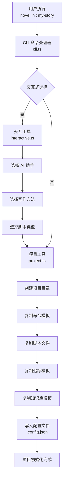
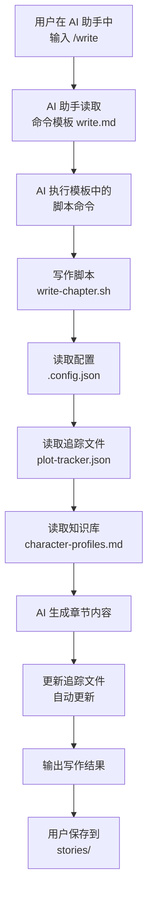
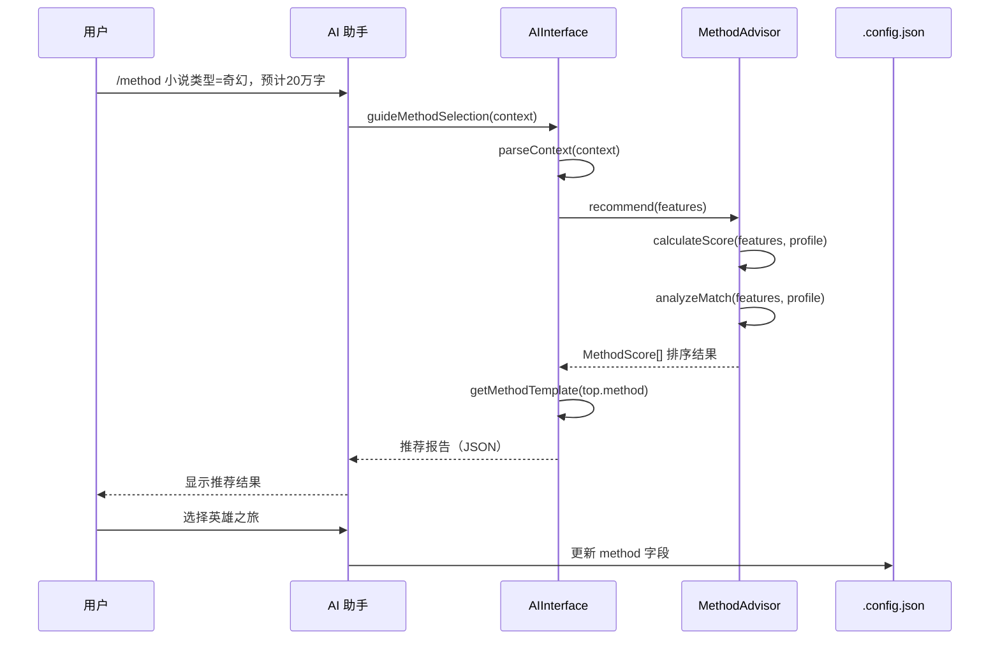

# ARCHITECTURE

## 1. 系统概述

Novel Writer 是一个 **CLI 工具 + AI 辅助创作系统** 的组合架构。核心设计理念是：

1. **CLI 工具**：负责项目初始化、插件管理、配置生成
2. **AI 辅助创作**：通过 AI 助手（Claude、Cursor、Gemini 等）内部的斜杠命令进行小说创作
3. **文件优先**：所有数据（故事、追踪、配置）以 JSON/YAML/Markdown 文件形式存储

---

## 2. 核心功能模块

### 2.1 模块总览

| 模块 | 路径 | 核心职责 | 是否运行时 |
|------|------|----------|-----------|
| CLI 命令处理器 | `src/cli.ts` | 解析命令行参数，执行 init/upgrade/plugins 等操作 | 是 |
| AI 接口层 | `src/ai-interface.ts` | 为 AI 助手提供智能推荐、方法转换等服务 | 是 |
| 方法推荐系统 | `src/method-advisor.ts` | 根据作品特征评分推荐写作方法 | 是 |
| 方法转换工具 | `src/method-converter.ts` | 在不同写作方法之间转换内容结构 | 是 |
| 混合方法管理器 | `src/hybrid-method.ts` | 组合多种写作方法的支持 | 是 |
| 插件管理器 | `src/plugins/manager.ts` | 插件安装、加载、卸载 | 是 |
| 项目工具 | `src/utils/project.ts` | 项目根目录检测、配置读取 | 是 |
| 交互工具 | `src/utils/interactive.ts` | 交互式选择（AI助手、写作方法等） | 是 |
| 星尘织梦 API 客户端 | `plugins/stardust-dreams/lib/` | 实时 API 调用、加密解密、安全存储 | 是（仅插件） |
| 命令模板系统 | `templates/commands/` | AI 斜杠命令定义（Markdown/TOML） | 静态 |
| 追踪模板系统 | `templates/tracking/` | 情节/角色/关系/时间线追踪模板 | 静态 |
| 写作脚本 | `scripts/bash/` / `scripts/powershell/` | AI 命令执行的辅助脚本 | 运行时（AI 触发） |

### 2.2 各模块详细说明

#### CLI 命令处理器 (`src/cli.ts`)

**输入**：命令行参数（如 `novel init my-story --ai claude`）

**输出**：创建的项目目录结构、配置文件

**核心函数/类**：

| 函数 | 职责 |
|------|------|
| `displayBanner()` | 显示欢迎横幅 |
| `init` 命令处理 | 创建项目目录、复制模板、初始化配置 |
| `check` 命令处理 | 检查系统环境和 AI 工具 |
| `plugins:add` / `plugins:remove` | 插件安装/移除 |
| `upgrade` 命令处理 | 升级项目配置文件 |

---

#### AI 接口层 (`src/ai-interface.ts`)

**输入**：`StoryContext`（genre、description、estimatedLength、targetAudience、tone、themes）

**输出**：`MethodSelection`（method、reason、template、tips）或转换建议、混合方案

**核心类**：

```typescript
class AIInterface {
  guideMethodSelection(context: StoryContext): Promise<MethodSelection>
  getGuidingQuestions(): string[]
  suggestConversion(currentMethod: string, storyProgress: any): Promise<any>
  designHybridScheme(context: StoryContext): Promise<any>
  getCurrentConfig(): Promise<any>
  updateProjectMethod(method: string | any): Promise<void>
  getMethodDisplayName(method: string): string
}
```

**内部依赖**：`MethodAdvisor`、`MethodConverter`、`HybridMethodManager`（构造时初始化）

---

#### 方法推荐系统 (`src/method-advisor.ts`)

**输入**：`StoryFeatures`（genre、length、audience、experience、focus、pace、complexity）

**输出**：`MethodScore[]`（method、score、reasons、pros、cons）排序数组

**核心类**：

```typescript
class MethodAdvisor {
  recommend(features: StoryFeatures): MethodScore[]
  calculateScore(features: StoryFeatures, profile: any): { total: number; reasons: string[] }
  analyzeMatch(features: StoryFeatures, profile: any, method: string): { pros: string[]; cons: string[] }
  getDetailedRecommendation(features: StoryFeatures): string
}
```

**评分权重**（实际代码中的分数值）：
- 类型匹配：30分
- 长度匹配：20分
- 受众匹配：15分
- 经验匹配：15分
- 创作重点匹配：10分
- 节奏匹配：5分
- 复杂度匹配：5分
- **总分**：100分

**导出函数**：
- `quickRecommend(genre, length, experience)` - 快速规则推荐
- `recommendHybrid(features)` - 混合方法推荐

---

#### 方法转换工具 (`src/method-converter.ts`)

**输入**：`StoryContent`（chapters、characters、worldSetting、themes、currentMethod）和目标方法名

**输出**：`ConversionMap`（chapters、structuralNotes、recommendations、warnings）或转换报告字符串

**核心类**：

```typescript
class MethodConverter {
  convert(content: StoryContent, targetMethod: string): ConversionMap
  generateConversionReport(content: StoryContent, targetMethod: string): string
}
```

**支持的转换**：
- `three-act → hero-journey` - 三幕转英雄之旅（12阶段映射）
- `three-act → seven-point` - 三幕转七点结构（7节点映射）
- `hero-journey → three-act` - 英雄之旅转三幕
- `hero-journey → story-circle` - 英雄之旅转故事圈（8步映射）
- `story-circle → three-act` - 故事圈转三幕
- `seven-point → three-act` - 七点结构转三幕
- **通用转换**：基于百分比的默认映射（25%-50%-25%）

---

#### 混合方法管理器 (`src/hybrid-method.ts`)

**输入**：`HybridConfig`（primary、secondary、micro）和故事详情（genre、length、complexity、subPlots、characters）

**输出**：`HybridStructure`（config、mapping、guidelines、examples）或推荐配置

**核心类**：

```typescript
class HybridMethodManager {
  recommendHybrid(genre: string, length: number, complexity: string): HybridConfig | null
  createHybridStructure(config: HybridConfig, storyDetails: any): HybridStructure
  generateHybridDocument(structure: HybridStructure): string
}
```

**预定义组合**（`validCombinations`）：
- **史诗奇幻组合**：hero-journey（主线）+ story-circle（角色弧线）
- **悬疑惊悚组合**：seven-point（主线）+ three-act（章节结构）
- **多线叙事组合**：three-act（主线）+ story-circle（支线）+ pixar-formula（场景）
- **成长故事组合**：story-circle（整体）+ hero-journey（关键章节）

**不兼容组合**：
- pixar-formula ↔ hero-journey（复杂度不匹配）
- pixar-formula ↔ seven-point（复杂度不匹配）

---

#### 插件管理器 (`src/plugins/manager.ts`)

**输入**：`projectRoot`（项目根目录）、插件名称、可选源路径

**输出**：`PluginConfig[]`（列出插件）或操作结果（安装/卸载）

**核心类**：

```typescript
class PluginManager {
  constructor(projectRoot: string)
  loadPlugins(): Promise<void>                // 扫描并加载所有插件
  listPlugins(): Promise<PluginConfig[]>      // 列出已安装插件配置
  installPlugin(pluginName: string, source?: string): Promise<void>
  removePlugin(pluginName: string): Promise<void>
  updatePlugin(pluginName: string, source?: string): Promise<void>
}
```

**内部方法**：
- `scanPlugins()` - 扫描插件目录（检测 `config.yaml`）
- `loadPlugin(pluginName)` - 加载单个插件
- `injectCommands(pluginName, commands)` - 注入命令到各 AI 目录（Claude/Cursor/Gemini/Windsurf/Roo Code）
- `registerExperts(pluginName, experts)` - 注册专家到 `experts/plugins/` 目录
- `convertMarkdownToToml(mdContent, cmd)` - Markdown → TOML 转换（Gemini 命令）

---

#### 星尘织梦 API 客户端（stardust-dreams 插件）

**输入**：会话 ID、API Key

**输出**：解密后的 Prompt

**核心组件**：

| 文件 | 职责 |
|------|------|
| `api-client.js` | 与远程 API 通信 |
| `decryptor.js` | AES-256-GCM 解密 |
| `secure-storage.js` | 加密存储认证信息 |
| `prompt-manager.js` | 协调获取-解密-填充流程 |
| `template-engine.js` | 变量替换、条件渲染、循环 |

---

## 3. 模块调用关系

### 3.1 完整用户操作流程

#### 流程一：项目初始化

```
用户执行命令
    ↓
CLI 命令处理器 (src/cli.ts)
    ↓
├── 交互工具 (src/utils/interactive.ts)
│       ↓
│   选择 AI 助手、写作方法、脚本类型
├── 项目工具 (src/utils/project.ts)
│       ↓
│   创建项目目录结构
├── 复制模板文件
│       ↓
│   templates/commands/ → .claude/commands/
│   templates/tracking/ → spec/tracking/
│   templates/knowledge/ → spec/knowledge/
├── 复制脚本文件
│       ↓
│   scripts/bash/ → .specify/scripts/bash/
│   scripts/powershell/ → .specify/scripts/powershell/
└── 写入配置文件
        ↓
    .specify/config.json
```

#### 流程二：AI 辅助创作（核心工作流）

```
用户在 AI 助手中输入斜杠命令
    ↓
AI 助手读取命令模板（Markdown/TOML）
    ↓
AI 助手执行模板中的脚本命令
    ↓
写作脚本 (scripts/bash/*.sh 或 scripts/powershell/*.ps1)
    ↓
├── 读取项目配置 (.specify/config.json)
├── 读取追踪文件 (spec/tracking/*.json)
├── 读取知识库 (spec/knowledge/*.md)
└── 执行写作逻辑
        ↓
    更新追踪文件（自动）
        ↓
    AI 助手输出写作结果
        ↓
    用户确认并保存到 stories/
```

#### 流程三：智能方法推荐（AI 接口调用）

```
用户使用 /method 命令
    ↓
AI 接口层 (src/ai-interface.ts)
    ↓
├── 解析自然语言参数 (parseContext)
│       ↓
│   提取类型、长度、受众、重点、节奏、复杂度
├── 方法推荐系统 (src/method-advisor.ts)
│       ↓
│   recommend(features) → 评分排序
│   calculateScore() → 计算匹配度
│   analyzeMatch() → 分析优缺点
└── 返回推荐结果
        ↓
    AI 助手显示推荐报告
        ↓
    用户选择方法 → 更新配置
```

---

## 4. 数据流转示意图

### 4.1 Mermaid 流程图：项目初始化



### 4.2 Mermaid 流程图：AI 辅助写作



### 4.3 Mermaid 序列图：方法推荐



---

## 5. 全局状态管理

> **重要说明**：本项目无前端状态管理（如 Redux/Vuex/Pinia），无后端 Session。所有状态通过**文件**管理。

### 5.1 状态管理方式

| 状态类型 | 文件路径 | 内容 |
|----------|----------|------|
| 项目配置 | `.specify/config.json` | 项目名称、AI类型、写作方法、版本号 |
| 情节追踪 | `spec/tracking/plot-tracker.json` | 情节发展节点、状态 |
| 角色状态 | `spec/tracking/character-state.json` | 角色发展状态、属性变化 |
| 关系追踪 | `spec/tracking/relationships.json` | 角色关系变化 |
| 时间线 | `spec/tracking/timeline.json` | 故事时间线 |
| 验证规则 | `spec/tracking/validation-rules.json` | 一致性验证规则 |
| 角色档案 | `spec/knowledge/character-profiles.md` | 角色详细设定 |
| 世界观 | `spec/knowledge/world-setting.md` | 世界观规则设定 |

### 5.2 配置文件结构

```json
// .specify/config.json
{
  "name": "my-story",
  "type": "novel",
  "ai": "claude",
  "method": "three-act",
  "created": "2024-01-01T00:00:00.000Z",
  "version": "0.20.0",
  "hybridScheme": null  // 混合方法时使用
}
```

### 5.3 状态更新机制

```
用户操作 → AI 助手执行命令 → 脚本更新文件 → 文件系统持久化
```

**特点**：
- **无运行时状态**：所有状态持久化到文件，重启后完全恢复
- **版本友好**：文件格式便于 Git 版本控制
- **多 AI 兼容**：不同 AI 助手读取同一套文件，状态共享
- **手动可编辑**：用户可直接编辑 JSON/Markdown 文件修改状态

---

## 6. 架构特点总结

### 6.1 核心设计理念

1. **CLI + AI 协作**：CLI 负责项目管理，AI 负责内容创作
2. **文件即状态**：所有数据以文件形式存储，无需数据库
3. **模板驱动**：命令模板定义 AI 行为，脚本执行具体操作
4. **插件化扩展**：通过插件添加新功能和写作风格

### 6.2 两种运行模式

| 模式 | 入口 | 主要操作 |
|------|------|----------|
| **CLI 模式** | `node dist/cli.js` | 项目初始化、插件管理、升级 |
| **AI 模式** | AI 助手内部斜杠命令 | 小说创作、追踪、分析 |

### 6.3 关键设计模式

| 模式 | 应用 |
|------|------|
| 模板方法 | 写作方法预设（presets） |
| 策略模式 | 方法推荐评分算法 |
| 插件模式 | 功能扩展系统 |
| 工厂模式 | 多 AI 平台命令生成 |

### 6.4 数据流总结

```
CLI 命令 → 文件生成 → AI 读取 → 脚本执行 → 文件更新 → AI 输出
```

**输入**：命令行参数、用户自然语言输入
**输出**：生成的项目结构、写作内容、更新的追踪文件